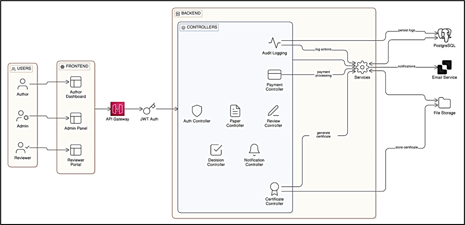
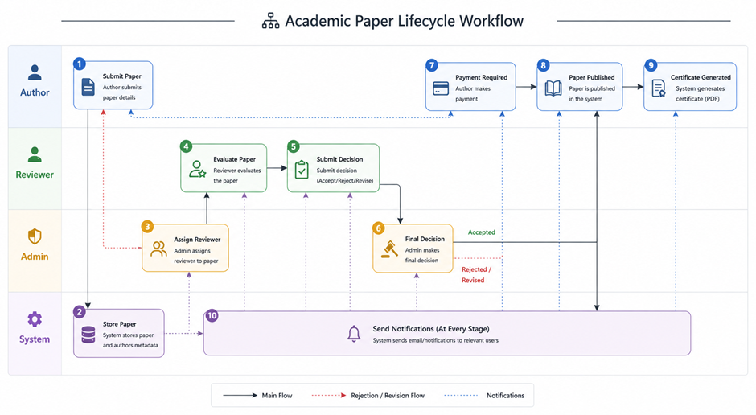
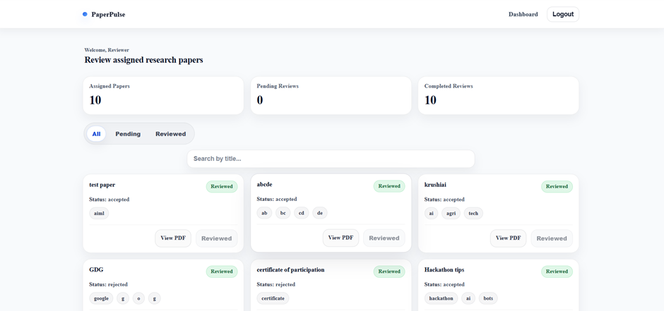

Below is a **complete GitHub README.md for PaperPulse**, built using the wireframe + filled with your actual system + includes **Mermaid diagrams, visual structure, FAANG-style clarity, and no fluff**.

You can copy-paste this directly into GitHub.

---

# 🎓 PaperPulse — Workflow-Driven Academic Publishing System


---

## ⚙️ System Overview

PaperPulse is a **controller-orchestrated academic publishing system** that manages the complete lifecycle of research papers using strict workflow enforcement, role-based access control, and state transitions.

Unlike CRUD systems, PaperPulse enforces **deterministic workflow progression** across submission → review → decision → payment → publication → certification.

---

## 🏗️ Architecture

### 🔷 High-Level System Architecture



---

### 🔷 Backend Execution Flow


---

## 🔄 Workflow Engine (Core System)



### 📌 Enforcement Rules

* All transitions validated in **controller layer**
* Role-based restrictions applied at each stage
* No direct DB-driven workflow logic
* Audit logging triggered at every transition

---

## 👥 Role System

| Role         | Responsibilities                                             |
| ------------ | ------------------------------------------------------------ |
| 👨‍🎓 Author   | Submit papers, track status, pay fees, download certificates |
| 🧑‍🔬 Reviewer | Review assigned papers, submit recommendations               |
| 🧑‍💼 Admin    | Assign reviewers, make decisions, publish papers             |

---

## ✨ Features

* 🔁 Strict workflow/state machine enforcement
* 👥 Role-Based Access Control (RBAC)
* 📄 Multi-author paper submission system
* 🔍 Reviewer assignment + review tracking
* ⚖️ Admin decision engine (accept/reject/publish)
* 💳 Payment gating before publication
* 📜 Auto-generated PDF certificates
* 📊 Audit logging for all system actions

---

## 🧠 System Design Highlights

* Controller-driven business logic (centralized orchestration)
* Finite State Machine (FSM) workflow enforcement
* Transaction-safe operations for critical flows
* Relational integrity via PostgreSQL
* Audit-first architecture for traceability
* Modular monolithic backend design

---

## 🧩 Module Breakdown

### Backend Modules

* Auth Module → JWT authentication + RBAC
* Paper Module → Submission + lifecycle tracking
* Review Module → Reviewer workflow
* Decision Module → Admin control engine
* Payment Module → Publication gate system
* Certificate Module → PDF generation pipeline
* Audit Module → System tracking layer

---

## 🔌 API Flow Design


### Example Flow

```text
POST /api/papers/submit
→ paper.controller.submitPaper()
→ paper.model.createPaper()
→ INSERT INTO papers
```

---

## 🗄️ Database Design

### Core Tables

* users → identity + RBAC
* papers → workflow entity
* paper_authors → multi-author mapping
* reviews → peer evaluation system
* reviewer_assignments → assignment tracking
* payments → publication gate
* notifications → user alerts
* audit_logs → system traceability

### Design Principle

> PostgreSQL is used strictly as a **persistent state store**, not a workflow engine.

---

## 🔐 Security Model

* JWT-based authentication
* Role-based route protection middleware
* Ownership validation (author-paper binding)
* Reviewer isolation enforcement
* Secure certificate access control

---

## 📜 Certificate System

* Triggered after publication
* Server-side PDF generation (PDFKit)
* Stored in secure file system
* Protected download endpoint with authorization checks

---

## 📊 Audit System

Tracks:

* Paper submission
* Reviewer assignment
* Review submission
* Decision updates
* Payment events
* Publication actions

📌 Purpose:

* System traceability
* Debugging workflow state
* Administrative transparency

---

## ⚖️ Engineering Trade-offs

| Decision       | Choice           | Reason                              |
| -------------- | ---------------- | ----------------------------------- |
| Architecture   | Modular Monolith | Strong transactional consistency    |
| Workflow Logic | Controller Layer | Full control over state transitions |
| Database Role  | Persistence only | Avoid hidden business logic         |
| File Storage   | Local            | Simplicity over cloud complexity    |

---

## 🚀 Tech Stack

* **Backend**: Node.js, Express.js
* **Frontend**: React.js
* **Database**: PostgreSQL
* **Auth**: JWT + bcrypt
* **File Handling**: PDFKit + local storage
* **Architecture**: Workflow-driven Modular Monolith

---

## 📌 System Classification

> PaperPulse is a **controller-orchestrated workflow engine built over a relational database with strict state-machine enforcement and role-based execution control.**

---

## 📈 Key Takeaways

* Real-world workflow orchestration system
* Strong backend architecture design
* State-machine enforced lifecycle management
* Role-restricted system execution
* Audit-driven backend design

---

## 📸 Optional UI Preview




---

## 🧠 Final Summary

PaperPulse demonstrates production-grade backend engineering principles including:

* Workflow engine design
* State transition enforcement
* Role-based system architecture
* Transaction-safe operations
* Audit-first system design
